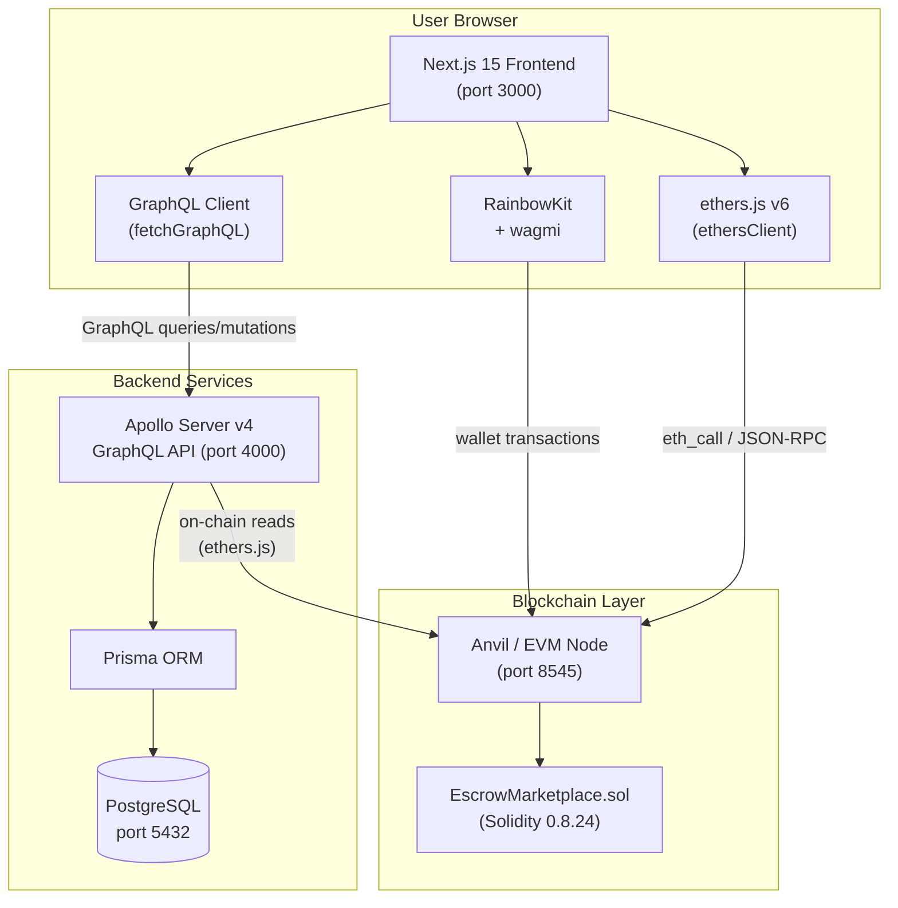

# Calebsons Web3 Escrow Marketplace Infrastructure Suite

[](https://github.com/Calebsons-Inc/Calebsons-Web3-Escrow-Marketplace-Infrastructure-Suite/actions/workflows/contracts_ci.yml)
[](https://github.com/Calebsons-Inc/Calebsons-Web3-Escrow-Marketplace-Infrastructure-Suite/actions/workflows/backend_ci.yml)
[](https://github.com/Calebsons-Inc/Calebsons-Web3-Escrow-Marketplace-Infrastructure-Suite/actions/workflows/frontend_ci.yml)
[](LICENSE)
[](https://soliditylang.org)
[](https://nodejs.org)

A production-ready, full-stack **Web3 escrow marketplace** built on EVM-compatible blockchains. Buyers and sellers transact with confidence backed by audited smart contract logic, a GraphQL API backend, and a modern Web3 frontend.

---

## Architecture



---

## Stack Overview

| Layer | Technology | Version |
|-------|-----------|---------|
| Smart Contract | Solidity + Foundry | 0.8.24 |
| Contract Libraries | OpenZeppelin | 5.x |
| Backend API | Apollo Server + Express | 4.x |
| Backend Language | TypeScript | 5.x |
| ORM | Prisma | 5.x |
| Database | PostgreSQL | 15 |
| Blockchain SDK | ethers.js | 6.x |
| Frontend Framework | Next.js (App Router) | 15.x |
| Frontend Language | TypeScript | 5.x |
| Wallet Integration | RainbowKit + wagmi | 2.x |
| Styling | Tailwind CSS | 3.x |
| Local EVM | Anvil (Foundry) | latest |
| Containers | Docker + Docker Compose | 3.9 |
| CI/CD | GitHub Actions | — |

---

## Quick Start

### Prerequisites

- [Node.js](https://nodejs.org) >= 20
- [Foundry](https://book.getfoundry.sh/getting-started/installation): `curl -L https://foundry.paradigm.xyz | bash && foundryup`
- [Docker](https://docs.docker.com/get-docker/) (for full-stack mode)

### Option A: Docker Compose (Recommended)

```bash
# 1. Clone the repo
git clone https://github.com/Calebsons-Inc/Calebsons-Web3-Escrow-Marketplace-Infrastructure-Suite.git
cd Calebsons-Web3-Escrow-Marketplace-Infrastructure-Suite

# 2. Start all services
docker compose -f docker/docker-compose.yml up --build

# 3. Deploy the contract to local Anvil
forge script contracts/script/Deploy.s.sol \
  --rpc-url http://127.0.0.1:8545 \
  --broadcast \
  --private-key 0xac0974bec39a17e36ba4a6b4d238ff944bacb478cbed5efcae784d7bf4f2ff80

# 4. Update ESCROW_CONTRACT_ADDRESS and restart
docker compose -f docker/docker-compose.yml restart backend frontend
```

| Service | URL |
|---------|-----|
| Frontend | http://localhost:3000 |
| GraphQL API | http://localhost:4000/graphql |
| Anvil RPC | http://localhost:8545 |

### Option B: Manual Local Development

```bash
# Terminal 1: Start Anvil
anvil --chain-id 31337

# Terminal 2: Deploy contract
cd contracts
forge install OpenZeppelin/openzeppelin-contracts --no-commit
forge script script/Deploy.s.sol --rpc-url http://127.0.0.1:8545 --broadcast \
  --private-key 0xac0974bec39a17e36ba4a6b4d238ff944bacb478cbed5efcae784d7bf4f2ff80

# Terminal 3: Start backend
cd backend
npm install
cp .env.example .env   # edit with your contract address and DB URL
npx prisma migrate dev --name init
npm run dev

# Terminal 4: Start frontend
cd frontend
npm install
# create .env.local with NEXT_PUBLIC_* variables
npm run dev
```

---

## Project Structure

```
.
├── contracts/                    # Solidity smart contracts (Foundry)
│   ├── foundry.toml
│   ├── src/EscrowMarketplace.sol
│   ├── script/Deploy.s.sol
│   └── test/EscrowMarketplace.t.sol
│
├── backend/                      # GraphQL API server
│   ├── src/
│   │   ├── index.ts
│   │   └── graphql/
│   │       ├── schema.graphql
│   │       └── resolvers/
│   ├── prisma/schema.prisma
│   └── README.md
│
├── frontend/                     # Next.js web application
│   ├── app/
│   │   ├── layout.tsx
│   │   ├── page.tsx
│   │   ├── providers.tsx
│   │   ├── dashboard/page.tsx
│   │   └── orders/[id]/page.tsx
│   ├── components/WalletConnect.tsx
│   ├── lib/
│   │   ├── ethersClient.ts
│   │   └── graphqlClient.ts
│   └── README.md
│
├── docker/
│   ├── docker-compose.yml
│   ├── backend.Dockerfile
│   ├── frontend.Dockerfile
│   └── postgres.Dockerfile
│
├── cicd/github_actions/
│   ├── contracts_ci.yml
│   ├── backend_ci.yml
│   └── frontend_ci.yml
│
├── walkthrough.md                # Full architecture walkthrough
└── README.md
```

---

## Smart Contract: Order Lifecycle

```
PENDING --(depositFunds)--> FUNDED --(markFulfilled)--> FULFILLED --(releaseFunds)--> RELEASED
                               |                             |
                          (raiseDispute)             (raiseDispute)
                               |                             |
                               +----------> DISPUTED <-------+
                                                |
                                         (resolveDispute)
                                                |
                                            RESOLVED
```

---

## Sub-Project READMEs

- [Backend README](backend/README.md) — API docs, environment setup, GraphQL reference
- [Frontend README](frontend/README.md) — UI setup, pages, component docs
- [Architecture Walkthrough](walkthrough.md) — Deep dive into how all parts interact

---

## Running Tests

### Smart Contract Tests

```bash
cd contracts
forge test -vvv
```

### Backend Type Check

```bash
cd backend
npm run build
```

### Frontend Lint + Type Check

```bash
cd frontend
npm run lint
npx tsc --noEmit
```

---

## Environment Variables

### Backend (`backend/.env`)

| Variable | Description |
|----------|-------------|
| `DATABASE_URL` | PostgreSQL connection string |
| `RPC_URL` | EVM JSON-RPC endpoint |
| `ESCROW_CONTRACT_ADDRESS` | Deployed contract address |
| `PORT` | API server port (default: 4000) |
| `FRONTEND_URL` | CORS allowed origin |

### Frontend (`frontend/.env.local`)

| Variable | Description |
|----------|-------------|
| `NEXT_PUBLIC_GRAPHQL_URL` | GraphQL API URL |
| `NEXT_PUBLIC_RPC_URL` | EVM RPC for read-only calls |
| `NEXT_PUBLIC_ESCROW_CONTRACT_ADDRESS` | Contract address |
| `NEXT_PUBLIC_WALLETCONNECT_PROJECT_ID` | WalletConnect v2 project ID |

---

## License

MIT — see [LICENSE](LICENSE) for details.

---

*Built with love by Calebsons Inc.*
